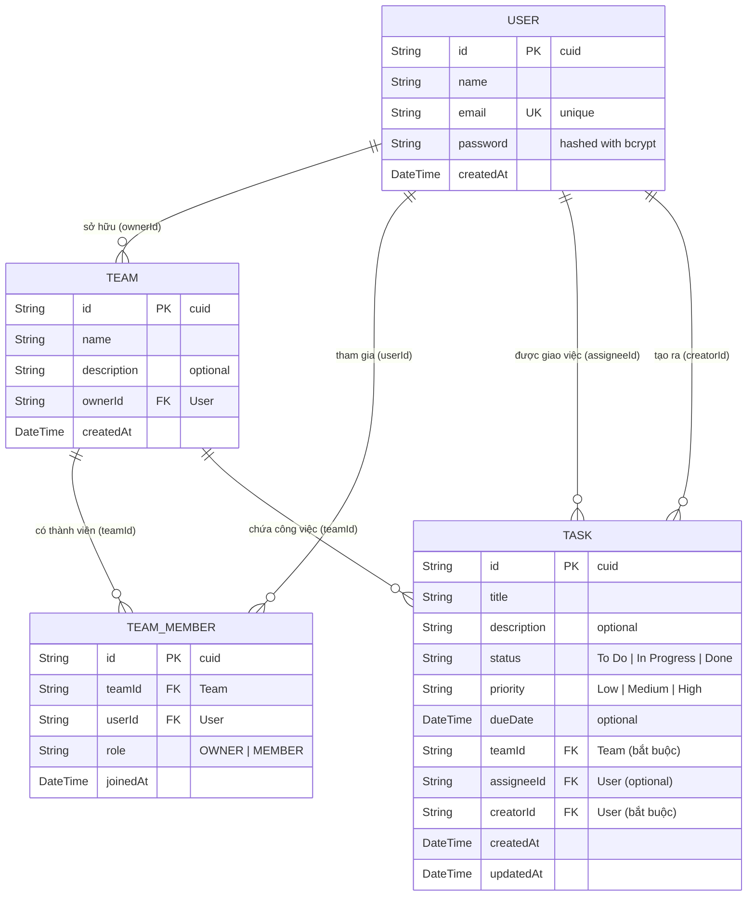

# TaskFlow – Team & Task Management App (Assignment 2 – SDN302)

Ứng dụng quản lý công việc và đội nhóm (**Task & Team Management App**) hoàn chỉnh cho **Assignment 2**, phát triển từ Assignment 1 trên nền tảng **Next.js (App Router, TypeScript)**, **Tailwind CSS**, **Prisma ORM**, **PostgreSQL (Supabase)**, kết hợp xác thực **JWT (jose) & bcryptjs** và cơ chế phân quyền kiểm soát truy cập (**Role-Based Access Control**).

---

## 🚀 1. Công nghệ sử dụng (Tech Stack)

- **Framework**: [Next.js](https://nextjs.org/) (App Router, React 19, TypeScript)
- **Styling**: [Tailwind CSS v4](https://tailwindcss.com/)
- **Icons**: [Lucide React](https://lucide.dev/)
- **Database ORM**: [Prisma ORM](https://www.prisma.io/)
- **Database**: [PostgreSQL (Supabase)](https://supabase.com/)
- **Authentication**: JWT Token (`jose`), Password Hashing (`bcryptjs`), HttpOnly Cookie, Next.js Middleware Access Control
- **Code Quality**: ESLint 9 (Flat Config), Prettier

---

## 📊 2. Sơ đồ thực thể quan hệ cơ sở dữ liệu (Mermaid ERD)

Sơ đồ quan hệ chuẩn giữa 4 model `User`, `Team`, `TeamMember`, và `Task`:



---

## 🔒 3. Ma trận Phân quyền & Kiểm soát truy cập (Access Control Matrix)

| Chức năng | Khách (Chưa đăng nhập) | Member | Team Owner | Ghi chú |
| :--- | :---: | :---: | :---: | :--- |
| Xem Trang chủ (`/`), Login, Register | ✅ | ✅ | ✅ | Các trang công khai |
| Xem Dashboard (`/dashboard`), Teams (`/teams`) | ❌ (Redirect `/login`) | ✅ | ✅ | Bắt buộc xác thực |
| Xem chi tiết Team (`/teams/[id]`) | ❌ | ✅ (nếu thuộc team) | ✅ | Trả về 403 nếu không thuộc team |
| Tạo Team mới | ❌ | ✅ | ✅ | Người tạo tự động nhận role OWNER |
| Chỉnh sửa thông tin Team | ❌ | ❌ | ✅ | Chỉ Owner có quyền |
| Xóa Team | ❌ | ❌ | ✅ | Chỉ Owner có quyền |
| Thêm thành viên qua email | ❌ | ❌ | ✅ | Chỉ Owner có quyền, gán role MEMBER |
| Xóa thành viên khỏi Team | ❌ | ❌ | ✅ | Không được tự xóa chính mình nếu là Owner |
| Tạo Task trong Team | ❌ | ✅ | ✅ | Bất kỳ thành viên nào trong team |
| Chỉnh sửa Task | ❌ | ✅ | ✅ | Mọi thành viên trong team |
| **Xóa Task** | ❌ | **Chỉ Creator hoặc Assignee** | **✅ Owner** | **BẮT BUỘC chỉ Creator, Assignee hoặc Owner** |

---

## 📡 4. Danh sách API Endpoints

### 4.1. Authentication
- `POST /api/auth/register`: Đăng ký tài khoản (validate email unique, hash bcrypt, tự động cấp JWT & cookie đăng nhập).
- `POST /api/auth/login`: Đăng nhập bằng email & password, trả về JWT & gán cookie HttpOnly.
- `POST /api/auth/logout`: Đăng xuất, xóa cookie session.
- `GET /api/auth/me`: Lấy thông tin user hiện tại qua session token.

### 4.2. Teams Management
- `GET /api/teams`: Lấy danh sách các team mà user tham gia hoặc sở hữu (kèm role).
- `POST /api/teams`: Tạo team mới (tự động tạo TeamMember role OWNER).
- `GET /api/teams/[id]`: Chi tiết team kèm danh sách members và tasks.
- `PUT /api/teams/[id]`: Cập nhật tên/mô tả team (Owner only).
- `DELETE /api/teams/[id]`: Xóa team và toàn bộ tasks liên quan (Owner only).

### 4.3. Team Members Management
- `POST /api/teams/[id]/members`: Thêm thành viên bằng email (Owner only, gán role "MEMBER").
- `DELETE /api/teams/[id]/members/[userId]`: Xóa thành viên khỏi team (Owner only, không cho xóa Owner).

### 4.4. Tasks Management
- `GET /api/teams/[id]/tasks`: Lấy danh sách tasks của team.
- `POST /api/teams/[id]/tasks`: Tạo task mới trong team (mọi thành viên trong team).
- `PUT /api/tasks/[id]`: Cập nhật status, priority, due date, assignee (mọi thành viên trong team).
- `DELETE /api/tasks/[id]`: Xóa task (Kiểm tra quyền: Creator, Assignee hoặc Team Owner).
- `GET /api/tasks`: Lấy toàn bộ task liên quan của user (hỗ trợ tương thích ngược).

---

## 🛠️ 5. Cài đặt & Chạy ứng dụng

### 1. Cài đặt thư viện:
```bash
npm install
# Các gói bổ sung cho Assignment 2:
npm install bcryptjs jose
npm install -D @types/bcryptjs
```

### 2. Cấu hình biến môi trường (`.env`):
```env
DATABASE_URL="postgresql://postgres.<project-ref>:<password>@aws-0-ap-southeast-1.pooler.supabase.com:6543/postgres?pgbouncer=true"
DIRECT_URL="postgresql://postgres.<project-ref>:<password>@aws-0-ap-southeast-1.pooler.supabase.com:5432/postgres"
JWT_SECRET="taskflow-super-secure-jwt-secret-assignment2-sdn302-2026"
```

### 3. Đồng bộ Database Schema (Migration):
```bash
npx prisma generate
npx prisma db push
# hoặc:
# npx prisma migrate dev --name init_assignment2
```

### 4. Chạy môi trường phát triển:
```bash
npm run dev
```
Truy cập ứng dụng tại `http://localhost:3000`.

### 5. Kiểm tra chất lượng mã nguồn:
```bash
npx tsc --noEmit
npm run lint
npm run build
```

---

## 📝 6. Đề xuất 5 Commit Messages chuẩn Conventional Commits

1. `feat(auth): implement JWT authentication, password hashing with bcryptjs, and route protection middleware`
2. `feat(database): update prisma schema with team, team member roles, and task creator relation`
3. `feat(teams): add teams and members API routes with owner-based access control`
4. `feat(tasks): implement team task endpoints with strict creator/assignee/owner deletion rules`
5. `feat(ui): build team dashboard, task board with status/priority filters, and responsive navbar auth state`
